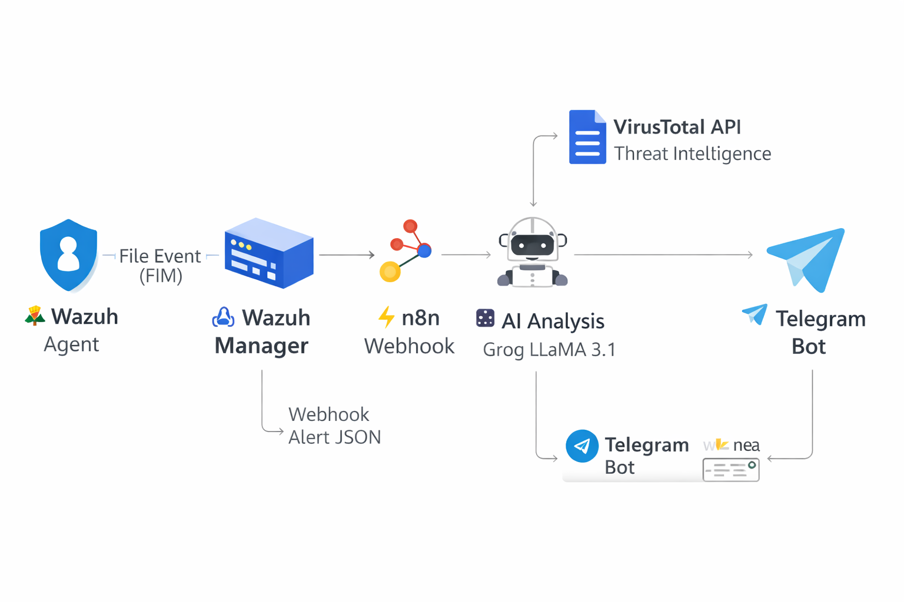

# Wazuh AI SOC Automation with VirusTotal Integration

This project implements an automated security monitoring pipeline. It uses Wazuh for detection, VirusTotal for threat intelligence, and Groq (LLaMA 3.1) for automated incident analysis and Telegram alerting.

## Key Features
* Real-time Monitoring: File Integrity Monitoring (FIM) via Wazuh agents.
* Threat Intelligence: Automated file reputation lookups using VirusTotal API.
* AI-Driven Analysis: L2-level incident reasoning using Groq (LLaMA 3.1).
* Instant Notifications: Real-time alert delivery to Telegram.
* Automated Triage: Severity-based alert classification and formatting.

## Architecture
Wazuh Agent -> Wazuh Manager -> VirusTotal API -> n8n Webhook -> AI Analysis -> Telegram

---

## Technical Evidence (Screenshots)

| Component | Documentation Link |
| :--- | :--- |
| Wazuh + VirusTotal Alert | [View Screenshot](wazuhalert.png) |
| Alert Metadata (JSON) | [View Screenshot](wazuhalert2.png) |
| n8n Workflow Automation | [View Screenshot](Screenshots/workflow.png) |
| AI (Groq) Integration | [View Screenshot](Screenshots/groq.png) |
| Telegram Incident Report | [View Screenshot](Screenshots/telegram.png) |

---

## Configuration

Detailed configuration guides for individual components:

1. Wazuh Webhook Integration: [Read Guide](config/wazuh-integration.md)
2. VirusTotal Integration: [Read Guide](config/virustotal-integration.md)

---

## Workflow Process
1. Detection: Wazuh identifies a file system event on a monitored endpoint.
2. Enrichment: Wazuh queries VirusTotal to check the reputation of the file hash.
3. Data Forwarding: The enriched alert is transmitted to the n8n automation engine.
4. AI Reasoning: The AI model analyzes the threat context and VirusTotal scores.
5. Reporting: A structured SOC report is sent to the designated Telegram channel.

---

## Project Structure
* Workflow/: [n8n-workflow.json](Workflow/n8n-workflow.json)
* config/: Integration configuration files.
* sample-output/: [Sample Alert Output](sample-output/telegram-alert.txt)

## Validated Test Cases
* Malicious File Detection: Validated via EICAR and known malicious hashes.
* File Integrity Monitoring: Detection of unauthorized changes in sensitive directories.
* High-Severity Alerts: Level 12 alerts triggered by VirusTotal reputation hits.

## Requirements
* Wazuh Manager and Agent (v4.x+).
* VirusTotal API Key.
* n8n Automation Platform.
* Groq AI API Key.
* Telegram Bot API Token.

---
**Author:** [Vijith Pramod](https://github.com/VijithPramod)
